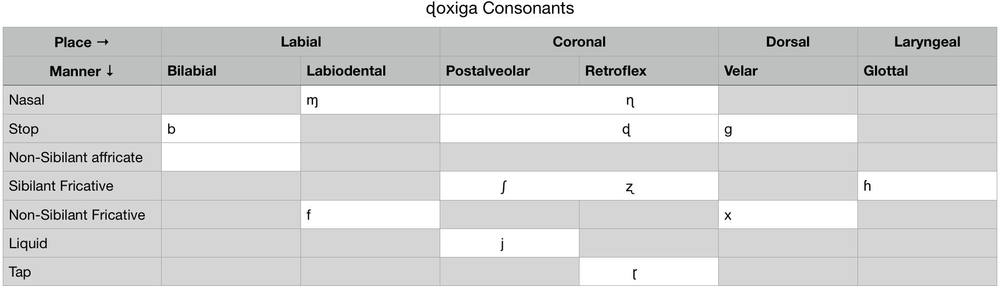

# ɖoxiga : A birth or start of everything.

ɖoxiga is conlang created for Learning purpose. Please feel free to add or modify new words or change the language.

```
biʐoɦ iʐ xi. ɖɘxo iʐ ga ɳɘ ʃiɱgɘ ɖɘ.
```

# Phonology

## ɖoxiga Consonants



## ɖoxiga Vowels


# Phonotactics

## Allowed Syllable Shape
* CV,CVC

## Stress Systems

* Always First Syllable 

# Morphology

### Affixes 
* i   - Feminist
* a 	- Masculine
* o   - All genders
* ɘ   - About the one talking
* u   - About others
* oɦ  - many things
* iʐ - one thing

## Default Word Order

(VSO) Verb Subject Object

## Adjectives

* Adjectives are derived from Nouns
* Adjectives come after Nouns

## Ad-positions/Prepositions

* Ad-positions comes from Verbs
* Comes before the Nouns

## Possession

* Possesses come before Possessor

## Articles

* Definite -  iʐ ( the book )
* Indefinite -  No marking

* Articles comes before the noun 


# Grammar

## Tenses

Any sentence start with following nouns represents the tenses. `xi` can not be included in many situations. Having no marking in the start means in present. 

* xi  : /xi/  - "present" (time)
* ga  : /ga/  - "future" 
* ɳɘ	: /ɳɘ/  - "past"

## Aspect

### Perfective 

No marking of past is considered perfective.

### Imperfective

Imperfective sentence is marked with `ɳɘxi`, `gaxi` for past and future, respectively. 

# Root Words

## ProNouns:
* ɖɘ   : /ɖɘ/ - "I/me"
* ɖɘxo : /ɖɘ.xo/ - "mine"
* ɳiʐ  : /ɳiʐ/ - "you" (singular)
* foɦ  : /foɦ/ - "you" (plural)
* ɳiɖoɦ: /ɳi.ɖoɦ/ "We/us"
* biʐoɦ: /bi.ʐoɦ/ "They/them"
* ɳuʐo : /ɳo.ʐu/ "he/she/it"

## Nouns:
* ofi   : /ofi/ - "female"
* ɳa    : /ɳa/  - "mail"
* xi    : /xi/  - "present" (time)
* ga    : /ga/  - "future" 
* ɳɘ	: /ɳɘ/  - "past"
* ʃiɱgɘ : /ʃiɱ.gɘ/ - "work"

## Verbs:
* jixo : /ji.xo/ - "to see"
* foʐi : /fo.ʐi/ - "to be brave"
* boʐo : /bo.ʐo/ - "to drink"
* ɖogi : /ɖo.gi/ - "to create"

## Feedback

Would love your feedback on this conlang. If you want to make any changes to this language please create a pull request. Created with love by g31s

## Authors

* **g31s** - *Initial work* - [g31s](https://github.com/g31s)

See also the list of [contributors](https://github.com/g31s/doxiga/contributors) who participated in this project.

## License

This project is licensed under the MIT License - see the [LICENSE.md](LICENSE.md) file for details

## End
```
biʐoɦ  iʐ     xi.    ɖɘxo iʐ  ga      ɳɘ      ʃiɱgɘ ɖɘ
Thers  the  present. Mine the future  (past)  work   I

The present is theirs; the future, for which I really worked, is mine.
```
